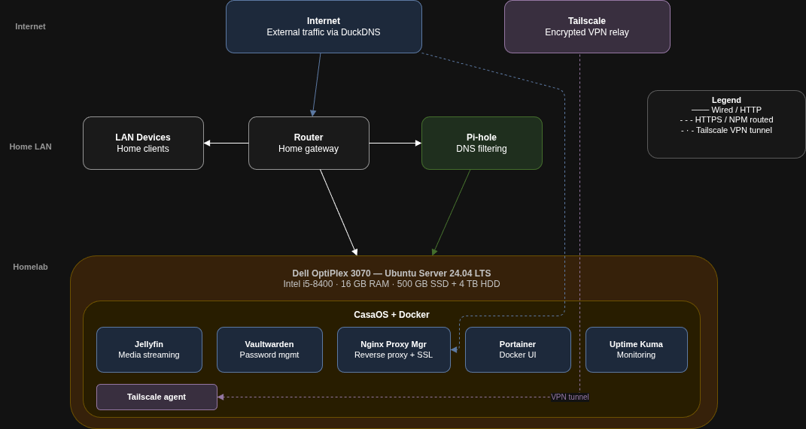
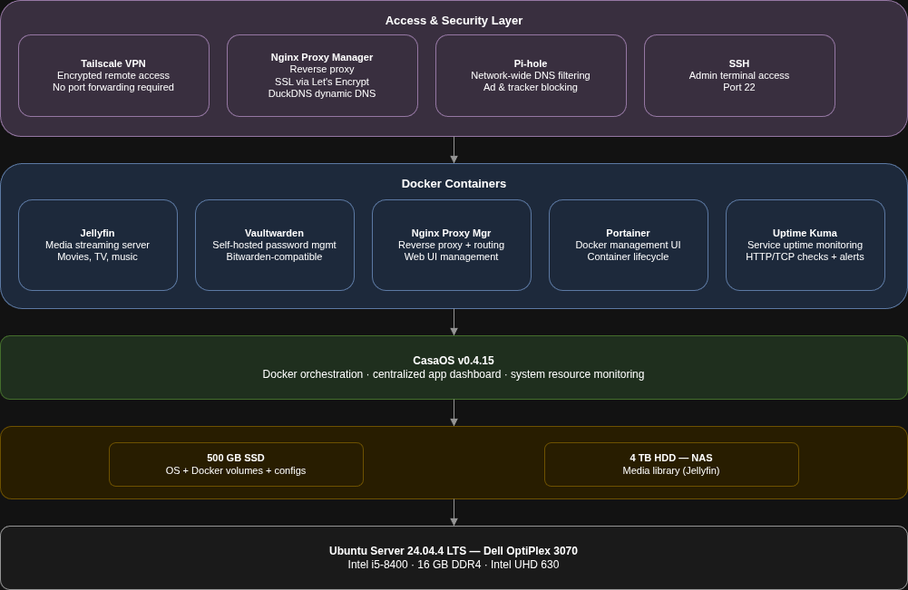
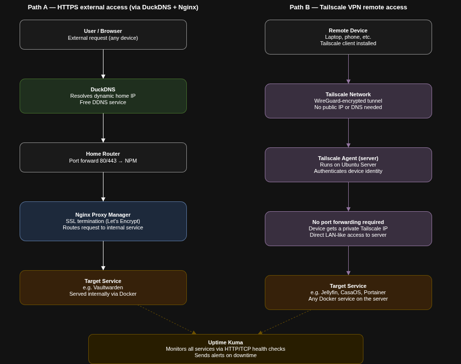

# HomeLab Infrastructure Documentation

## Overview

This repository documents my self-hosted homelab environment running Ubuntu Server and CasaOS.

The lab serves as a platform for learning Linux administration, networking, storage management, containerized applications, and infrastructure documentation.

## Objectives

- Learn Linux system administration
- Practice network management
- Deploy self-hosted services
- Implement secure remote access
- Create backup and recovery procedures

## Technologies

- Ubuntu Server
- CasaOS
- Docker
- Jellyfin
- Vaultwarden
- Tailscale
- Nginx Proxy Manager
- Portainer 
- Uptime Kuma
- Pi-hole

## Architecture diagrams
 
### Network topology
> Three-tier layout showing internet, home LAN, and homelab server — including Pi-hole in the DNS path and Tailscale for remote access.
 

 
---
 
### Service stack
> Every layer from bare metal up through Ubuntu, CasaOS, Docker containers, and the access/security tier.
 

 
---
 
### Traffic flow
> Side-by-side comparison of external HTTPS access (via DuckDNS + Nginx Proxy Manager) and Tailscale VPN remote access.
 

 
---

## Services

| Service | Purpose |
|----------|---------|
| NAS | Centralized storage |
| Vaultwarden | Password management |
| Jellyfin | Media streaming |
| Tailscale | Secure remote access |
| Nginx Proxy Manager | Reverse Proxy Management |
| Uptime Kuma | Uptime Monitoring |
| Portainer | Docker Container Management |
| Pi-hole | Network-wide ad blocker |

## Skills Demonstrated

- Linux Administration
- Docker Container Management
- Networking
- VPN Configuration
- Storage Management
- System Documentation
- Troubleshooting
