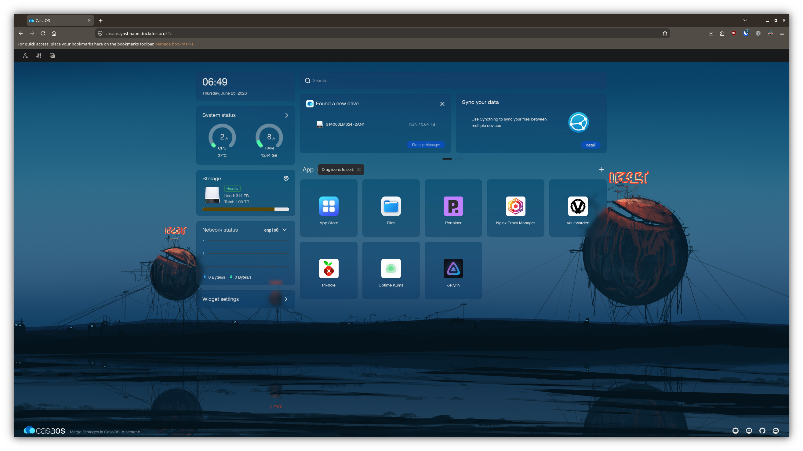
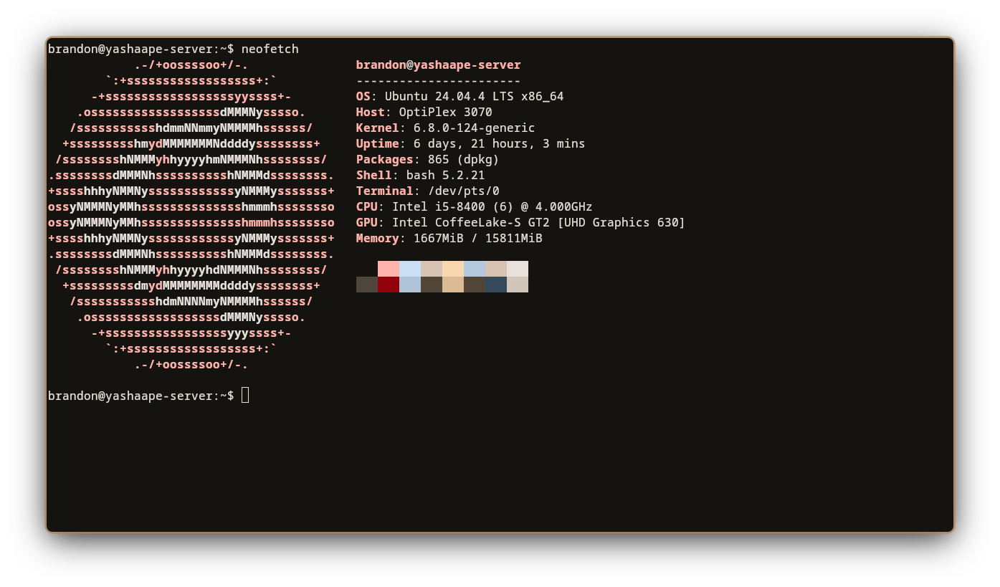
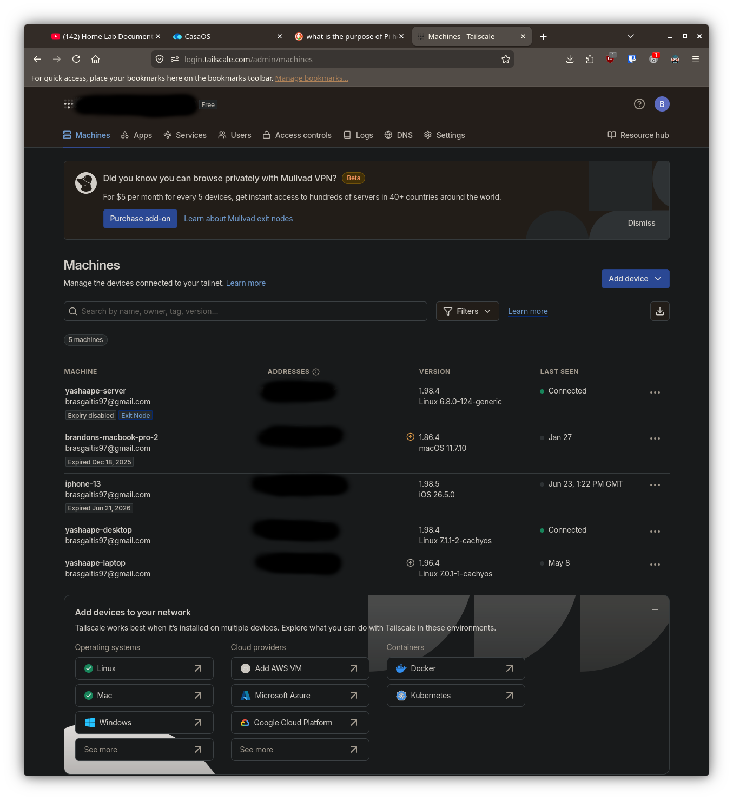
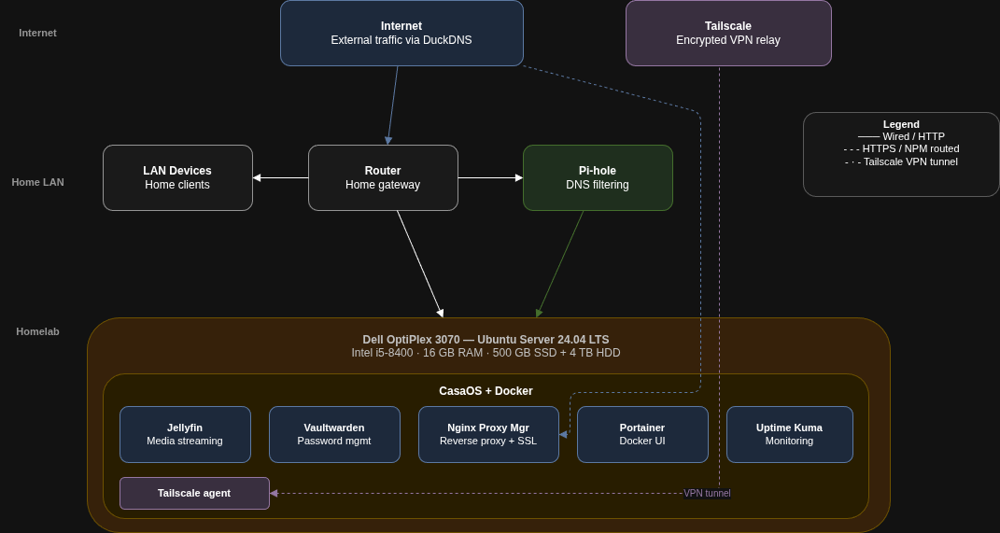
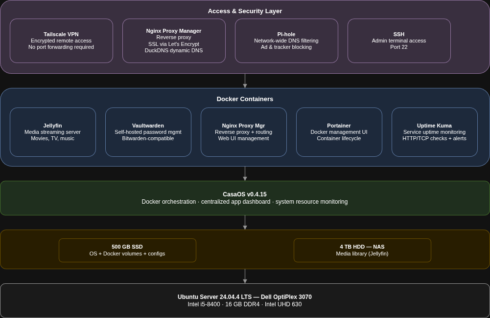
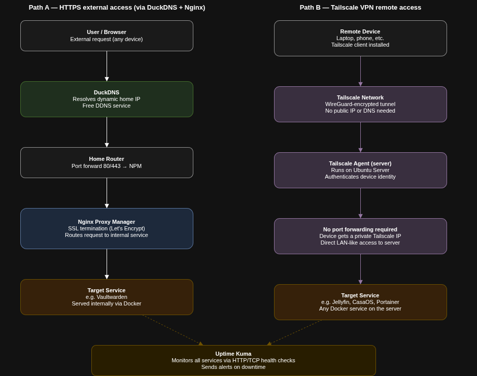

# HomeLab Infrastructure Documentation
 
## Overview
 
This repository documents a self-hosted homelab environment designed to mirror a small IT work environment. The lab spans two physical hosts:
 
- **Linux Services Host** — Ubuntu Server + CasaOS running self-hosted applications (media, password management, monitoring, reverse proxy, networking)
- **Windows Server / Domain Controller** — Windows Server 2025 running Active Directory Domain Services
📄 **[Windows Server & Active Directory Documentation →](docs/windows_server.md)**
 
The lab serves as a platform for learning Linux and Windows system administration, Active Directory, networking, storage management, containerized applications, and infrastructure documentation.
 
## Documentation Index
 
| Doc | Description |
|---|---|
| [Windows Server / Active Directory](docs/windows_server.md) | Domain controller setup, AD DS, hardware specs |
| [Hardware](docs/hardware.md) | Linux host specifications |
| [Services](docs/services.md) | Self-hosted application details |
| [Network](docs/network.md) | Network overview |
| [Security](docs/security.md) | Security practices |
| [Backups](docs/backups.md) | Backup and recovery strategy |
 
## Objectives
 
- Learn Linux and Windows Server system administration
- Deploy and manage Active Directory Domain Services
- Practice network management
- Deploy self-hosted services
- Implement secure remote access
- Create backup and recovery procedures
- Simulate a real-world small business IT environment

## Screenshots

## Technologies
 
**Linux Host**
- Ubuntu Server
- CasaOS
- Docker
- Jellyfin
- Vaultwarden
- Tailscale
- Nginx Proxy Manager
- Portainer
- Uptime Kuma
- Pi-hole

**Windows Server / Domain**
- Windows Server 2025
- Active Directory Domain Services (AD DS)
- DNS

## Architecture diagrams
 
### Network topology
> Three-tier layout showing internet, home LAN, and homelab server — including Pi-hole in the DNS path and Tailscale for remote access.
 

 
---
 
### Service stack
> Every layer from bare metal up through Ubuntu, CasaOS, Docker containers, and the access/security tier.
 

 
---
 
### Traffic flow
> Side-by-side comparison of external HTTPS access (via DuckDNS + Nginx Proxy Manager) and Tailscale VPN remote access.
 

 
---

## Services
 
| Service | Purpose |
|----------|---------|
| Active Directory | Domain identity & access management |
| NAS | Centralized storage |
| Vaultwarden | Password management |
| Jellyfin | Media streaming |
| Tailscale | Secure remote access |
| Nginx Proxy Manager | Reverse Proxy Management |
| Uptime Kuma | Uptime Monitoring |
| Portainer | Docker Container Management |
| Pi-hole | Network-wide ad blocker |

## Skills Demonstrated
 
- Linux Administration
- Windows Server Administration
- Active Directory / Domain Services
- Docker Container Management
- Networking
- VPN Configuration
- Storage Management
- System Documentation
- Troubleshooting
